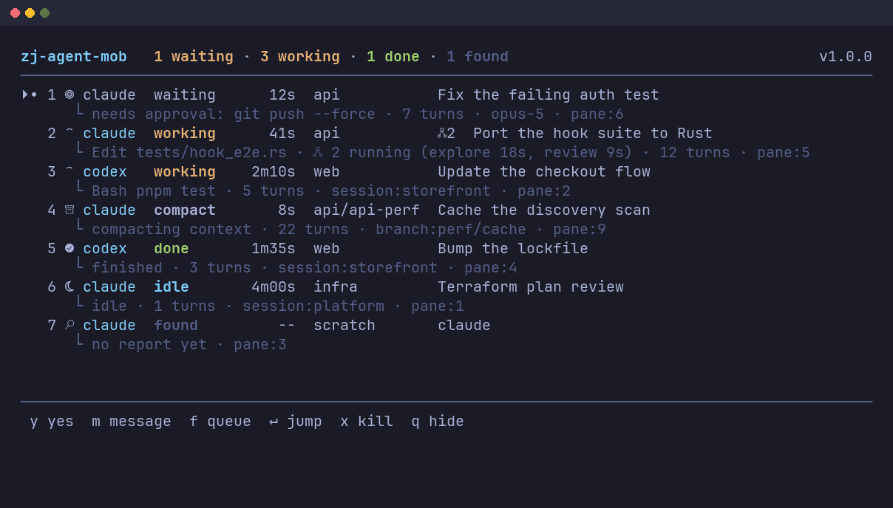
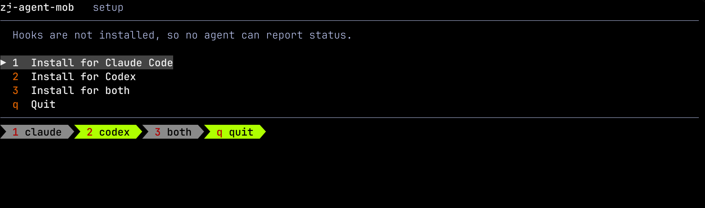
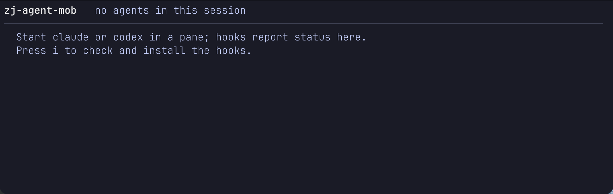
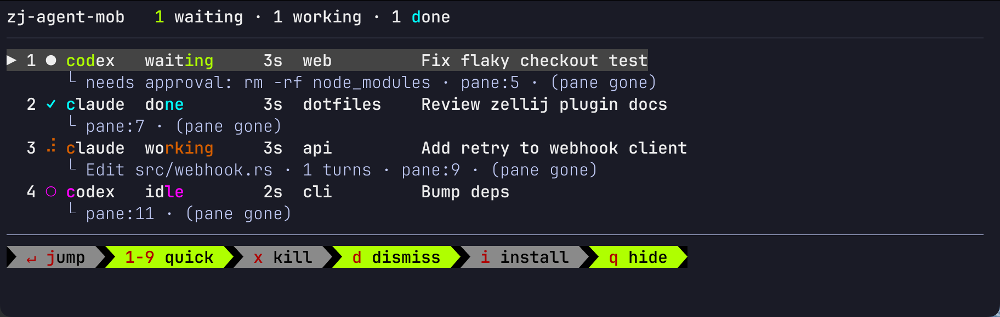
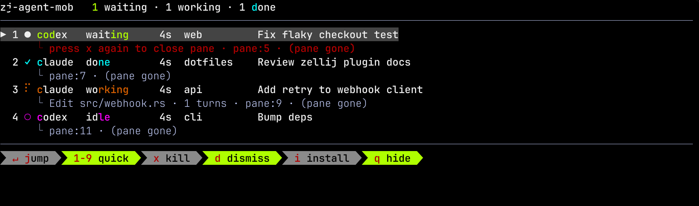
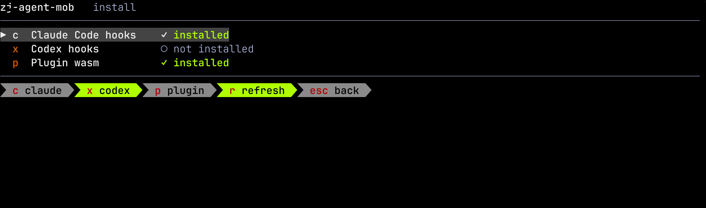

# Zellij Agent Mob (zj-agent-mob)

[](https://github.com/mohseenrm/zj-agent-mob/actions/workflows/ci.yml)
[](https://github.com/mohseenrm/zj-agent-mob/releases/latest)
[](LICENSE)


**Keep track of every coding agent you have running, from one floating panel.**

Run enough Claude Code and Codex agents and they scatter across panes, tabs, and whole Zellij sessions. This panel shows all of them at once: who is working, who is blocked waiting on you, and who finished while you were elsewhere. Press <kbd>Enter</kbd> to jump straight to any of them, even in another session.



Without it, a blocked agent is invisible until you happen to cycle past its pane. Rows sort by urgency, so whatever needs you the most, sits at the top.

- **See every agent at once**, across sessions, with live status and the task each one is on.
- **Jump to any pane** with <kbd>Enter</kbd>, across tabs *and* sessions.
- **Get pulled in when needed**: the panel can pop itself open the moment an agent blocks.
- **Answer permission prompts in place** with <kbd>a</kbd> / <kbd>r</kbd>, without leaving the panel (opt-in).
- **Kill a runaway** with <kbd>x</kbd>, two-step so you never do it by accident.
- **No daemon, socket, or state file.** Agent hooks pipe straight to the plugin.

> Inspired by [herdr](https://herdr.dev), without adopting an entire new multiplexer.

## Contents

- [Requirements](#requirements)
- [Quick start](#quick-start)
- [Screens](#screens)
- [Keys](#keys)
- [Statuses](#statuses)
- [Known limitations](#known-limitations)
- Additional docs:
  - [Setup: install, Zellij configuration](docs/setup.md)
  - [How it works: status transport, task summaries](docs/how-it-works.md)
  - [Local development](docs/development.md)
  - [Troubleshooting](docs/troubleshooting.md)

## Requirements

| Requirement | Why |
|---|---|
| Zellij 0.44+ | Plugin API (`LaunchOrFocusPlugin`, pipes, `RunCommandResult`) |
| `jq` | The hook parses hook-event JSON; the installer merges settings |
| `curl` or `wget` | Only for the one-line install; not needed from a clone |
| Claude Code, Codex, or both | The agents being monitored |
| Rust + `wasm32-wasip1` target | Only to build from source; not needed if you download a release |

## Quick start

Three steps: install, bind a key, restart your agents.

### 1. Install

No clone and no Rust toolchain required:

```sh
curl -fsSL https://github.com/mohseenrm/zj-agent-mob/releases/download/v0.2.0/init.sh | sh
```

This downloads the plugin and hook script for that release, wires up whichever of Claude Code and Codex you have, and leaves an installer at `~/.config/zj-agent-mob/install.sh` so the in-panel install screen works from then on.

Prefer to read before running? Same thing in two steps:

```sh
curl -fsSL -O https://github.com/mohseenrm/zj-agent-mob/releases/download/v0.2.0/init.sh
less init.sh && sh init.sh
```

<details>
<summary>Or build it from source</summary>

```sh
rustup target add wasm32-wasip1
cargo build --release --target wasm32-wasip1
./init.sh
```

From a clone, `./init.sh` uses your local build and downloads nothing.

</details>

### 2. Bind a key

Add to `~/.config/zellij/config.kdl`:

```kdl
keybinds {
    session {
        bind "c" {
            LaunchOrFocusPlugin "file:~/.config/zellij/plugins/zj-agent-mob.wasm" {
                floating true
                move_to_focused_tab true
            }
            SwitchToMode "Normal"
        }
    }
}
```

Press <kbd>Ctrl</kbd>+<kbd>s</kbd> then <kbd>c</kbd> to open the panel.

### 3. Restart your agents

> [!IMPORTANT]
> Restart any running `claude` / `codex` sessions after installing. Hooks are read at session start, so existing sessions won't report status.

Then start an agent in any pane and open the panel: it shows up within a turn. If the panel stays empty, [troubleshooting](docs/troubleshooting.md#the-panel-says-no-agents-in-this-session) walks through it in order.

See [docs/setup.md](docs/setup.md) for per-target install, the in-panel install screen, layout registration, and every config knob.

## Screens

**First run.** If neither agent's hooks are installed, nothing can report status, so the panel offers to install them rather than sitting empty. Press <kbd>1</kbd>, <kbd>2</kbd>, or <kbd>3</kbd> to install without leaving Zellij.



**Hooks installed, nothing running yet.** Start `claude` or `codex` in any pane and it appears here.



**The agent list.** One row per agent with status, elapsed time, project, and task, each with an indented detail line.



**Killing an agent.** <kbd>x</kbd> sends an interrupt and arms the row; pressing it again closes the pane.



**The install screen** (<kbd>i</kbd>) toggles each target: pressing a row's key installs it when absent and uninstalls it when present.


Targets are independent, so running only one agent's hooks is a supported state:



## Keys

### Agent list

| Key | Action |
|---|---|
| <kbd>j</kbd> / <kbd>k</kbd>, <kbd>↓</kbd> / <kbd>↑</kbd> | Move selection |
| <kbd>Enter</kbd> | Jump to that agent's pane (across tabs *and* sessions) and hide the panel |
| <kbd>1</kbd>–<kbd>9</kbd> | Jump straight to agent N |
| <kbd>x</kbd> | Send SIGINT to the agent; press again to close the pane (own session only) |
| <kbd>a</kbd> / <kbd>r</kbd> | Approve / reject a parked permission prompt (opt-in, see below) |
| <kbd>d</kbd> | Dismiss a `done` badge |
| <kbd>i</kbd> | Open the install screen |
| <kbd>q</kbd> / <kbd>Esc</kbd> | Hide the panel |

### Install screen

| Key | Action |
|---|---|
| <kbd>c</kbd> / <kbd>x</kbd> / <kbd>p</kbd> | Toggle Claude hooks / Codex hooks / the plugin wasm |
| <kbd>j</kbd> / <kbd>k</kbd>, <kbd>↓</kbd> / <kbd>↑</kbd> | Move selection |
| <kbd>Enter</kbd> | Toggle the selected row |
| <kbd>r</kbd> | Re-read install state |
| <kbd>i</kbd> / <kbd>q</kbd> / <kbd>Esc</kbd> | Back to the agent list |

## Statuses

| Status | Meaning | Hook event |
|---|---|---|
| `failed` | Stopped by an error (rate limit, billing, auth) | `StopFailure` (Claude only) |
| `waiting` | Needs you now (permission prompt / question) | `Notification` (Claude), `PermissionRequest` (both) |
| `idle-wait` | Has been waiting on you for a while | `Notification` / `idle_prompt` (Claude only) |
| `done` | Finished while you were elsewhere | `Stop` |
| `compact` | Compacting context (looks like a hang otherwise) | `PreCompact`, cleared by `PostCompact` |
| `working` | Processing a turn | `UserPromptSubmit`, refreshed by `PreToolUse`/`PostToolUse` |
| `idle` | Session open, nothing new | `SessionStart`, or `done` after you visit the pane |
| `found` | Spotted by the process scan, but it has never fired a hook | - |
| `unknown` | Its Zellij session is gone, so its state is unknowable | - |

Rows sort in that order, so whatever needs you most is at the top. A `found` row is normal rather than broken: the agent was already running when hooks were installed, and it fills in the moment it next does anything.

### Answering permission prompts from the panel

Off by default. With `ZJ_AGENT_APPROVE=1` set in the agent's environment, a permission prompt
parks in the panel and <kbd>a</kbd> / <kbd>r</kbd> approve or reject it without leaving the panel:

```
▶ 1 ● codex   waiting    2s  web        Fix flaky checkout test
      └ needs approval: rm -rf node_modules · pane:5
        ┌──────────────────────────────────────────┐
        │ Bash                                     │
        │ rm -rf node_modules                      │
        │ a approve    r reject    ↵ jump to pane  │
        └──────────────────────────────────────────┘
```

This is the one hook that blocks the agent's turn, which is why it is opt-in. It waits
`ZJ_AGENT_APPROVE_TIMEOUT` seconds (default 30) and then falls through to the agent's own prompt,
so the worst case is the normal interactive experience. Reject is <kbd>r</kbd>, not <kbd>d</kbd>,
so a mis-keyed dismiss can never answer a prompt.

## Known limitations

- Agents started before `init.sh` ran aren't tracked (no hooks installed yet). Restart them.
- Agents in other Zellij sessions are found by the process scan and can be jumped to, but they only report live status while a panel is open in their own session. <kbd>x</kbd> is refused for them: Zellij's kill and interrupt calls act on the current session only, so jump first.
- Claude has no "permission granted" event, so `waiting` to `working` relies on the next tool-event heartbeat. With `ZJ_AGENT_HEARTBEAT=0`, `waiting` persists until the turn ends.

Hitting something not listed here? See [docs/troubleshooting.md](docs/troubleshooting.md).

## Releases

Prebuilt `zj-agent-mob.wasm` binaries and changelogs are on the [releases page](https://github.com/mohseenrm/zj-agent-mob/releases). Pushing a `v*` tag builds the wasm, verifies it exports what Zellij needs, and publishes it automatically.

## License

[Apache-2.0](LICENSE)
